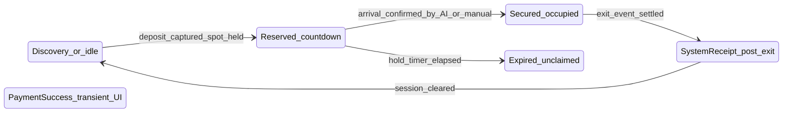
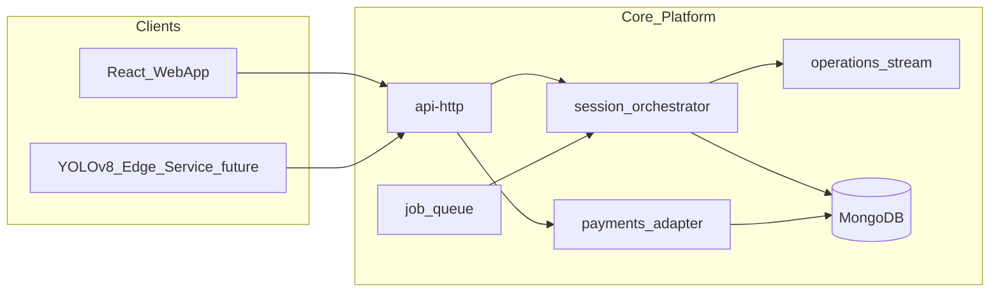

# VisionPark Node.js + MongoDB Backend Design (Inferred from Frontend)

Design source: routing in [frontend/src/App.jsx](frontend/src/App.jsx), domain pages under `frontend/src/{driver,owner,attendant,admin,guest,shared}/`, and persisted simulation keys documented in [README.md](README.md) (e.g. `vp_session_state`, `vp_owner_incidents`, `vp_debt_radar`). Auth today is mocked ([frontend/src/shared/auth/Login.jsx](frontend/src/shared/auth/Login.jsx) branches by email substring); all business data is client-side mock or `localStorage`.

---

## A. SYSTEM OVERVIEW

VisionPark is a **multi-tenant smart parking platform** with four primary actor classes plus a **public discovery** surface:

- **Drivers** discover branches on a map, check vehicle/spot compatibility, pay a deposit to **reserve** a specific spot, then move through a **time-bounded reservation**, **active occupancy (secured)**, and **checkout/receipt** phases ([frontend/src/driver/pages/DriverMap.jsx](frontend/src/driver/pages/DriverMap.jsx), [frontend/src/driver/pages/ActiveSession.jsx](frontend/src/driver/pages/ActiveSession.jsx)).
- **Lot owners (operators)** define **regional hierarchy → branch (lot) → zone → spot grid**, configure **category-based pricing and overstay multipliers**, manage **attendants**, view **operations** (cameras, system alerts, incidents, debt radar), and consume **analytics and financial reports** ([frontend/src/owner/pages/ParkingManagement.jsx](frontend/src/owner/pages/ParkingManagement.jsx), [frontend/src/owner/pages/Operations.jsx](frontend/src/owner/pages/Operations.jsx)).
- **Attendants** run a **live occupancy grid** with conflict handling, resolve **AI exception queues**, sell **walk-up time deposits** via POS, manage **overstays** (payment/clamp), **enforcement/debt radar**, log **incidents** with evidence, and close shifts with **Z-reports** ([frontend/src/attendant/pages/LiveGrid.jsx](frontend/src/attendant/pages/LiveGrid.jsx), [frontend/src/attendant/pages/WalkUpPOS.jsx](frontend/src/attendant/pages/WalkUpPOS.jsx), [frontend/src/attendant/pages/Incidents.jsx](frontend/src/attendant/pages/Incidents.jsx)).
- **Platform administrators** oversee **cross-tenant health**, **owner accounts**, **active auth sessions**, **audit logs**, **payment gateway configuration**, **backups**, **alert thresholds**, and **global system configuration** ([frontend/src/admin/pages/SessionManager.jsx](frontend/src/admin/pages/SessionManager.jsx), [frontend/src/admin/pages/AuditLog.jsx](frontend/src/admin/pages/AuditLog.jsx)).

The backend must become the **single source of truth** for identity, lot topology, availability, parking sessions, payments, enforcement state, incidents, AI queue items, operational alerts, and audit history. **YOLOv8** is a **future external inference service** that publishes structured detection events into an ingestion boundary; the core platform validates, correlates, and drives workflows (sessions, exceptions, live grid).

---

## B. DOMAIN BREAKDOWN (from frontend inference)

### B.1 Business domains

| Domain | Primary UI | Inferred responsibility |
|--------|-------------|-------------------------|
| **Discovery & marketing map** | [GuestMap.jsx](frontend/src/guest/pages/GuestMap.jsx) | Public read: branch pins, headline availability, pricing hints; no auth required |
| **Identity & access** | [Login.jsx](frontend/src/shared/auth/Login.jsx), [DriverSignUp.jsx](frontend/src/shared/auth/DriverSignUp.jsx), [AdminLogin.jsx](frontend/src/shared/auth/admin/AdminLogin.jsx) | Credentials, roles (driver / owner / attendant / platform_admin), sessions, password flows |
| **Driver profile & vehicle registry** | [DriverProfile.jsx](frontend/src/driver/pages/DriverProfile.jsx) | PII, plate rules by licence type, vehicle category, default payment rail |
| **Reservation & parking session** | [DriverMap.jsx](frontend/src/driver/pages/DriverMap.jsx), [ActiveSession.jsx](frontend/src/driver/pages/ActiveSession.jsx) | Spot hold, deposit/payment timestamp, reservation expiry, secured dwell time, exit receipt, expiry notifications (server-side schedule + push later) |
| **Driver history & receipts** | [DriverHistory.jsx](frontend/src/driver/pages/DriverHistory.jsx) | Immutable session ledger, penalties, receipt metadata |
| **Lot topology & policy** | [ParkingManagement.jsx](frontend/src/owner/pages/ParkingManagement.jsx), [PricingSettings.jsx](frontend/src/owner/pages/PricingSettings.jsx) | Branches with geo + hours + service type, zones with allowed categories, spot lifecycle status, rate tables, branch overstay multiplier |
| **Workforce** | [AttendantManagement.jsx](frontend/src/owner/pages/AttendantManagement.jsx) | Attendant records, branch assignment, shift windows, status |
| **Owner operations center** | [Operations.jsx](frontend/src/owner/pages/Operations.jsx) | Camera registry & health, cross-cutting **system alerts**, incident inbox, debt radar visibility |
| **Live operations (attendant)** | [LiveGrid.jsx](frontend/src/attendant/pages/LiveGrid.jsx) | Per-lot **spot state** (Free / Reserved / Occupied / Conflict), squatter workflow flags |
| **AI exception resolution** | [AIExceptions.jsx](frontend/src/attendant/pages/AIExceptions.jsx) | Queue of low-confidence or inconsistent LPR / category reads awaiting human resolution |
| **Walk-up commerce** | [WalkUpPOS.jsx](frontend/src/attendant/pages/WalkUpPOS.jsx) | Anonymous or plate-first sessions, time deposit, rates by category, receipt share/print flows |
| **Overstay & enforcement** | [Overstays.jsx](frontend/src/attendant/pages/Overstays.jsx), [Enforcement.jsx](frontend/src/attendant/pages/Enforcement.jsx) | Debt cases, clamp state, payment capture, linkage to sessions |
| **Incidents** | [Incidents.jsx](frontend/src/attendant/pages/Incidents.jsx) | Typed incidents, optional amounts, multi-plate damage, photo/video evidence (object storage in production) |
| **Shift economics** | [ZReport.jsx](frontend/src/attendant/pages/ZReport.jsx) | End-of-shift cash/card rollups (aggregated from server transactions) |
| **Owner commercial** | [FinancialReports.jsx](frontend/src/owner/pages/FinancialReports.jsx), [PayoutSettings.jsx](frontend/src/owner/pages/PayoutSettings.jsx), [Analytics.jsx](frontend/src/owner/pages/Analytics.jsx), [Dashboard.jsx](frontend/src/owner/pages/Dashboard.jsx) | Revenue, utilization, scoped filters (region/city/branch) |
| **Platform governance** | Admin module pages | Cross-tenant analytics, **network health**, **session manager** (device/IP/suspicion), **audit log**, **payment gateway**, **backup/recovery**, **alert thresholds**, **system config** |

### B.2 User flows (behavior-level)

1. **Guest**: browse map → open branch detail → route to signup/login.
2. **Driver signup/login**: capture profile + vehicle DNA (category, plate, contacts) → browse map with compatibility filtering → select branch → select zone/spot → confirm **deposit payment** → **active reservation** with countdown → (physical arrival inferred) **secured parking** with usage-based billing rules → **system exit** producing final duration/cost/receipt → history.
3. **Owner**: configure branches/zones/spots → set pricing → manage attendants → monitor live ops (cameras, alerts, incidents, debt) → review finances/analytics.
4. **Attendant**: observe **LiveGrid** → act on conflicts → clear **AI exceptions** → sell **walk-up** time → collect **overstay** fees or apply **clamp** → log **incidents** → end shift **Z-report**.
5. **Platform admin**: manage owner accounts, inspect/kill suspicious **sessions**, tune **alerts** and **gateways**, review **audit** trail, trigger/support **backups**.

### B.3 State transitions (inferred; server-authoritative)

**Driver parking session (mobile app session)**

- **Reserved**: server stores `reservation_expires_at`, linked **spot hold**, deposit transaction id.
- **Secured**: server stores `occupancy_started_at`, metered pricing inputs from branch policy.
- **SystemReceipt**: finalized dwell, line items, receipt id (replaces local `vp_final_parked_seconds` pattern).
- **Expired**: hold released, spot returns to pool (policy may charge partial fee—product decision; not hard-coded in UI).

**Spot occupancy (lot view)**

- **Free** → **Reserved** (hold) → **Occupied** (matched session) → **Free**; **Conflict** when predicted plate/expected session disagrees with observed occupancy (from [LiveGrid.jsx](frontend/src/attendant/pages/LiveGrid.jsx) behavior).

**Walk-up / POS session**

- Created with plate, category, purchased duration → states like **Active** vs **Completed** ([WalkUpPOS.jsx](frontend/src/attendant/pages/WalkUpPOS.jsx)); overstay states in [Overstays.jsx](frontend/src/attendant/pages/Overstays.jsx): `WALK_UP_OVERSTAY`, `OVERNIGHT_ABANDONED`, `PAID`.

**AI exception**

- **Pending** → **Resolved** (manual plate/category correction) or **Auto-dismissed** (policy).

**Incident**

- Created by attendant → visibility to owner ops → statuses such as **Pending Review**, **Report Filed**, **Admin CCTV Review Needed** (from mock strings in [Incidents.jsx](frontend/src/attendant/pages/Incidents.jsx), [Operations.jsx](frontend/src/owner/pages/Operations.jsx)).

**Enforcement / debt radar**

- Case open → **clamped** flag → payment/clamp release → case closed (mirrors [Enforcement.jsx](frontend/src/attendant/pages/Enforcement.jsx) local merge behavior).

---

## C. DATABASE DESIGN (MongoDB collections)

Naming is logical; implement as collections with indexes on foreign keys (`organizationId`, `branchId`, `spotId`, `plate`, `status`, timestamps).

**Tenancy & identity**

- **`organizations`**: lot operator (owner tenant), billing profile, status.
- **`users`**: authentication identity (email, password hash), global user id.
- **`memberships`**: `{ userId, organizationId, role: owner|attendant }`, branch scope, shift defaults, status.
- **`platform_admins`**: separate elevated principals OR `users` + `platform_roles` collection (avoid conflating tenant attendants with sysadmins).
- **`auth_sessions`**: refresh tokens, device/user-agent, IP/geo hints, `suspicious` flags, `revokedAt` (replaces [SessionManager.jsx](frontend/src/admin/pages/SessionManager.jsx) mock).
- **`password_reset_tokens`**: hashed tokens, expiry (supports forgot-password flows).

**Lot model**

- **`branches`**: name, region/city, address, `location` (GeoJSON), `openTime`/`closeTime`, `serviceType` (e.g. day-only), default **overstay multiplier**, organizationId.
- **`zones`**: branchId, name, `allowedVehicleCategories[]`.
- **`spots`**: zoneId, human id (`A01`), status cache optional (denormalized for speed), `allowedVehicleCategories[]`, camera bindings optional.
- **`cameras`**: branchId, zone/spot attachment, stream URL or edge device id, health `online|offline`, last heartbeat.

**Commercial policy**

- **`pricing_tables`**: branch-scoped rows: `vehicleCategory` → base rate; effective windows; currency.
- **`platform_payment_gateways`**: provider keys metadata (encrypted), enabled methods (see [PaymentGateway.jsx](frontend/src/admin/pages/PaymentGateway.jsx)).
- **`payout_destinations`**: owner bank / Telebirr accounts ([PayoutSettings.jsx](frontend/src/owner/pages/PayoutSettings.jsx)).

**Parking sessions (unify driver reserve + walk-up)**

- **`parking_sessions`**:  
  - Keys: `organizationId`, `branchId`, `zoneId`, `spotId` (nullable for walk-up until assigned), `type: DRIVER_APP | WALK_UP`.  
  - Identity: `driverUserId` optional, `plate`, `vehicleCategory`, `licenceType`/`region` when applicable (POS).  
  - Lifecycle: `status` enum covering reserved/secured/completed/expired/cancelled.  
  - Times: `reservationStartsAt`, `reservationEndsAt`, `occupancyStartsAt`, `occupancyEndsAt`.  
  - Money: `pricingVersion`, `lineItems[]`, `depositPaymentId`, `finalPaymentId`.  
  - Enforcement: `clampState`, links to `enforcement_case_ids`.

**Payments**

- **`payments`**: provider (Chapa/Telebirr/cash), amount, currency, status, idempotency key, `sessionId`, raw provider payload refs.

**AI & vision (future-ready)**

- **`detection_events`**: append-only ingest from YOLOv8 workers: `cameraId`, `capturedAt`, `plateGuess`, `confidence`, `bbox`, `vehicleClassGuess`, `mediaObjectKey`, `processingVersion`.
- **`ai_exceptions`**: links to `detection_event_id`, `type` (`UNREADABLE_PLATE`, `EXIT_MISMATCH`, `CATEGORY_MISMATCH`, …), `status`, resolution fields (`correctedPlate`, `correctedCategory`, resolver user, timestamps).

**Operations & safety**

- **`incidents`**: type (property damage, dispute, fled without payment, …), plates[], amount, narrative, media refs, `reportedByUserId`, branch/zone/spot, `destination` (`owner` vs enforcement), workflow status.
- **`enforcement_cases`**: debt radar rows; clamp, payments, linkage to plates/sessions.
- **`system_alerts`**: camera offline, overstay, capacity, LPR mismatch, acknowledgement fields ([Operations.jsx](frontend/src/owner/pages/Operations.jsx) mock types).
- **`alert_policies`**: thresholds per org/branch ([AlertThresholds.jsx](frontend/src/admin/pages/AlertThresholds.jsx)).

**Reporting & compliance**

- **`audit_events`**: actor, action, resource, diff, IP, correlation id ([AuditLog.jsx](frontend/src/admin/pages/AuditLog.jsx)).
- **`z_reports`**: attendant user, branch, window, aggregates, sealed totals ([ZReport.jsx](frontend/src/attendant/pages/ZReport.jsx)).
- **`platform_settings`**: feature flags, maintenance, global limits ([SystemConfig.jsx](frontend/src/admin/pages/SystemConfig.jsx)).
- **`backup_jobs` / `restore_jobs`**: metadata for admin backup UI ([BackupRecovery.jsx](frontend/src/admin/pages/BackupRecovery.jsx)).

**Media**

- **`media_objects`**: S3/GridFS pointer, mime, size, sha256, uploader, linked incident/session id (never store large base64 in Mongo as the prototype did).

**Relationships (textual)**

- `organization` 1—N `branches` 1—N `zones` 1—N `spots`.  
- `spot` 0—1 active **`parking_sessions`** row with reserved/secured semantics; history N.  
- `parking_session` N—N **`payments`** (deposit + final).  
- `detection_events` N—1 `camera`; may spawn 0—1 `ai_exceptions`; successful correlation updates `parking_sessions` / `spots` state.  
- `incidents` and `enforcement_cases` reference `branch` + optional `spot` + `users`.

---

## D. SERVICE ARCHITECTURE

Logical Node services (could be monolith modules initially; boundaries below define seams).

1. **`api-http`**: REST (and optional GraphQL later) + validation + RBAC middleware.  
2. **`auth-service`**: login, refresh, password reset, MFA hooks (UI shows 2FA toggle for admin profile).  
3. **`catalog-service`**: branches/zones/spots/cameras CRUD; public read subsets for Guest/Driver maps.  
4. **`session-orchestrator`**: reservation holds, occupancy transitions, conflict flags, idempotent payment confirmation handlers.  
5. **`pricing-engine`**: pure functions over `pricing_tables` + clocks + category; invoked by orchestrator and POS.  
6. **`payments-adapter`**: Chapa/Telebirr/etc., webhooks, reconciliation ledger into `payments`.  
7. **`operations-stream`**: WebSocket/SSE fan-out for LiveGrid, alerts, incident updates (backed by Redis pub/sub or Mongo change streams with caution).  
8. **`media-service`**: pre-signed uploads, virus scan hook, thumbnail pipeline.  
9. **`ai-ingestion-api`**: authenticated channel for edge workers; schema-versioned payloads → `detection_events` + rules → auto updates vs `ai_exceptions`.  
10. **`reporting-service`**: aggregates for owner dashboards + admin analytics (materialized nightly or incremental).  
11. **`audit-service`**: centralized append for sensitive actions.  
12. **`jobs-worker`**: BullMQ/Agenda cron consumers (expiry, alerts, backups, reconciliation).

**Service boundaries rationale**: keep **payments** and **AI ingestion** isolated for PCI/security and high-volume spikes; keep **session orchestrator** the only writer that mutates `spots` + `parking_sessions` together in transactions.

---

## E. EVENT FLOW (real-time + AI + sessions)

**Textual data flows**

1. **Reserve flow**: Driver `POST /sessions/reserve` → orchestrator locks spot (Mongo transaction) → `payments` intent → provider checkout URL/token → webhook `payment.captured` → session `Reserved` + `reservationEndsAt` → **event** `SpotHeld` → operations-stream pushes grid cell update.

2. **Countdown expiry**: job worker scans `reservationEndsAt` due → transition `Expired` → `SpotReleased` event → grid Free.

3. **Arrival / occupancy**: future **YOLOv8 worker** sends `detection_events` with plate + spot camera correlation → orchestrator matches active reservation → `Secured` + `occupancyStartsAt`; mismatch → `Conflict` on spot + optional `ai_exceptions`.

4. **Exit / receipt**: exit camera event or attendant manual checkout → finalize bill using **pricing-engine** + deposits → `SystemReceipt` + payment capture/refund → receipt id → driver poll or push.

5. **Walk-up POS**: attendant `POST /sessions/walk-up` with duration purchase → immediate `Active` session without prior driver user; ties to branch default spot assignment rules.

6. **Incident filed**: attendant `POST /incidents` + media upload → owner **Operations** stream + optional `system_alerts` if severity high.

7. **AI exception resolved**: attendant PATCH → orchestrator may retroactively adjust session linkage (audit mandatory).

**High-level diagram**

---

## F. API DESIGN (endpoint list only)

Base prefix examples: `/api/v1` for tenant APIs, `/api/v1/platform` for super-admin. **No implementation here.**

### Auth

- `POST /auth/register/driver`
- `POST /auth/login`
- `POST /auth/refresh`
- `POST /auth/logout`
- `POST /auth/password/forgot`
- `POST /auth/password/reset`
- `POST /auth/admin/login` (or unified login with elevated scope)
- `GET /auth/me`
- `PATCH /auth/me/password`
- `POST /auth/mfa/setup` / `POST /auth/mfa/verify` (future-safe)

### Sessions (parking)

- `GET /sessions/me` (active for driver)
- `GET /sessions/me/history`
- `GET /sessions/:sessionId`
- `POST /sessions/reserve` (branch, zone, spot, vehicleCategory, payment method)
- `POST /sessions/:sessionId/confirm-payment` (idempotent, if not purely webhook-driven)
- `POST /sessions/:sessionId/cancel`
- `POST /sessions/:sessionId/check-in` (manual fallback)
- `POST /sessions/:sessionId/check-out`
- `GET /sessions/:sessionId/receipt`
- `POST /sessions/walk-up` (attendant POS)
- `PATCH /sessions/walk-up/:sessionId` (extend time, correct plate—if product needs)
- `GET /sessions` (owner/attendant filtered by branch)

### Parking (catalog & availability)

- `GET /public/branches` (map pins, optional bbox query)
- `GET /public/branches/:branchId`
- `GET /public/branches/:branchId/availability-summary`
- `GET /branches` (owner scoped)
- `POST /branches`
- `PATCH /branches/:branchId`
- `DELETE /branches/:branchId`
- `POST /branches/:branchId/zones`
- `PATCH /zones/:zoneId`
- `DELETE /zones/:zoneId`
- `POST /zones/:zoneId/spots`
- `PATCH /spots/:spotId`
- `DELETE /spots/:spotId`
- `GET /branches/:branchId/grid` (spots + live status for attendant/owner)
- `GET /spots/:spotId`

### Incidents

- `POST /incidents`
- `GET /incidents` (filters: branch, status, type)
- `GET /incidents/:incidentId`
- `PATCH /incidents/:incidentId` (status transitions, owner notes)
- `POST /incidents/:incidentId/media` (upload intent / complete)
- `GET /incidents/:incidentId/media/:mediaId`

### Enforcement / overstays

- `GET /enforcement/cases`
- `GET /enforcement/cases/:caseId`
- `PATCH /enforcement/cases/:caseId` (clamp, partial payments)
- `POST /enforcement/cases/:caseId/payments`
- `GET /overstays` (query view over sessions/cases)
- `POST /overstays/:sessionId/resolve-payment`

### AI ingestion (external worker + human UI)

- `POST /ai/ingestions/detections` (edge worker; API key / mTLS)
- `GET /ai/exceptions`
- `GET /ai/exceptions/:exceptionId`
- `PATCH /ai/exceptions/:exceptionId/resolve`
- `POST /ai/exceptions/:exceptionId/escalate`

### Cameras & operations alerts

- `GET /branches/:branchId/cameras`
- `POST /branches/:branchId/cameras`
- `PATCH /cameras/:cameraId`
- `POST /cameras/:cameraId/heartbeat`
- `GET /alerts`
- `PATCH /alerts/:alertId/acknowledge`

### Workforce & owner settings

- `GET /attendants`
- `POST /attendants`
- `PATCH /attendants/:userId`
- `DELETE /attendants/:userId`
- `GET /pricing` / `PUT /pricing` (branch-scoped tables)
- `GET /payout-destinations` / `PUT /payout-destinations`
- `GET /owner/profile` / `PATCH /owner/profile`
- `GET /driver/profile` / `PATCH /driver/profile`
- `GET /admin/profile` / `PATCH /admin/profile`

### Platform admin

- `GET /platform/owners`
- `POST /platform/owners`
- `PATCH /platform/owners/:organizationId`
- `DELETE /platform/owners/:organizationId`
- `GET /platform/sessions` (auth sessions)
- `DELETE /platform/sessions/:sessionId`
- `GET /platform/audit-events`
- `GET /platform/analytics/summary`
- `GET /platform/network-health` (aggregated probes)
- `GET /platform/payment-gateways` / `PUT /platform/payment-gateways`
- `GET /platform/system-config` / `PUT /platform/system-config`
- `GET /platform/alert-thresholds` / `PUT /platform/alert-thresholds`
- `POST /platform/backups` / `GET /platform/backups` / `POST /platform/backups/:jobId/restore`

### Z-report

- `POST /attendant/z-reports` (close shift)
- `GET /attendant/z-reports/:reportId`
- `GET /owner/z-reports` (branch filter)

### Realtime transport (non-REST)

- `GET /realtime/subscribe` (WebSocket upgrade) **or** `GET /sse/operations` — channel names: `branch:{id}:grid`, `branch:{id}:alerts`, `org:{id}:incidents`.

---

## G. BACKGROUND JOBS

- **Reservation expiry sweeper**: atomically expire holds and free spots.
- **Overstay evaluator**: compare `occupancyEndsAt` vs purchased window for walk-ups and reserved deposits; spawn `enforcement_cases` + `system_alerts`.
- **Pricing recomputation guard**: nightly validate pricing table integrity per branch.
- **Alert engine**: camera heartbeat staleness, capacity thresholds, repeated LPR mismatch rate ([Operations.jsx](frontend/src/owner/pages/Operations.jsx) patterns).
- **Suspicious session heuristics**: long duration, geo/IP mismatch flags ([SessionManager.jsx](frontend/src/admin/pages/SessionManager.jsx)).
- **Webhook reconciliation**: poll provider for stuck `payments`.
- **Analytics rollups**: hourly/daily revenue & utilization for owner/admin dashboards.
- **Retention jobs**: purge raw `detection_events` media per policy while keeping metadata.
- **Backup/restore workers**: snapshot scheduling + restore validation tasks ([BackupRecovery.jsx](frontend/src/admin/pages/BackupRecovery.jsx)).

---

## H. YOLOv8 INTEGRATION DESIGN (future only)

**Deployment shape**: containerized **edge inference service** per site (or per N cameras) running YOLOv8 models for **vehicle detection + plate ROI**; optional second-stage **LPR model**. No model code inside the main Node API.

**Contracts**

- **Ingress**: RTSP / on-device frame grabber → bounded queue → inference at configurable FPS per camera.  
- **Egress**: HTTPS `POST /ai/ingestions/detections` with HMAC or mTLS client cert, payload versioning (`schemaVersion`, `modelVersion`, `cameraId`, `frameTimestamp`, `trackId`, `plateText|null`, `scores`, `croppedPlateObjectKey` optional).

**Platform responsibilities**

- Correlate `trackId` continuity across frames at the orchestrator or a lightweight **tracker service**.  
- Map camera geometry to **spot IDs** via calibration tables (`cameras.spotMasks` or homography params).  
- Confidence gating: below threshold → create `ai_exceptions` instead of mutating sessions.  
- Human resolution loop feeds ground truth for **model retraining exports** (batch ETL, not runtime).

**Non-goals now**: running training, storing full video in Mongo, synchronous inference inside HTTP request lifecycle.

---

### Implementation note (post-design)

When you exit plan mode, a pragmatic first delivery is a **modular monolith** (single Node process) implementing the orchestrator + REST + change-stream/Socket.IO fan-out, with collections above and a stubbed `ai/ingestions` route behind feature flags.
